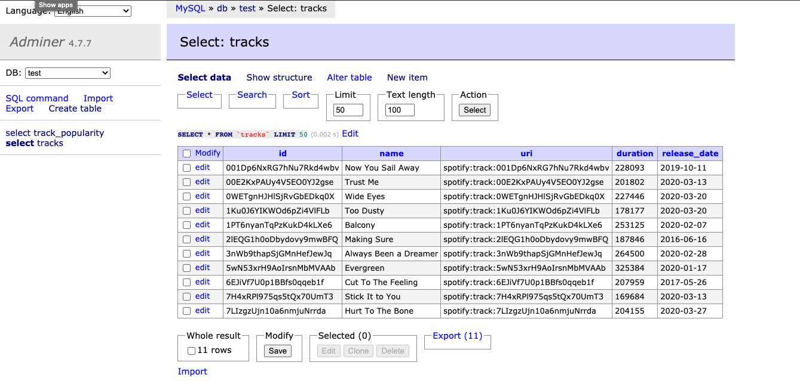
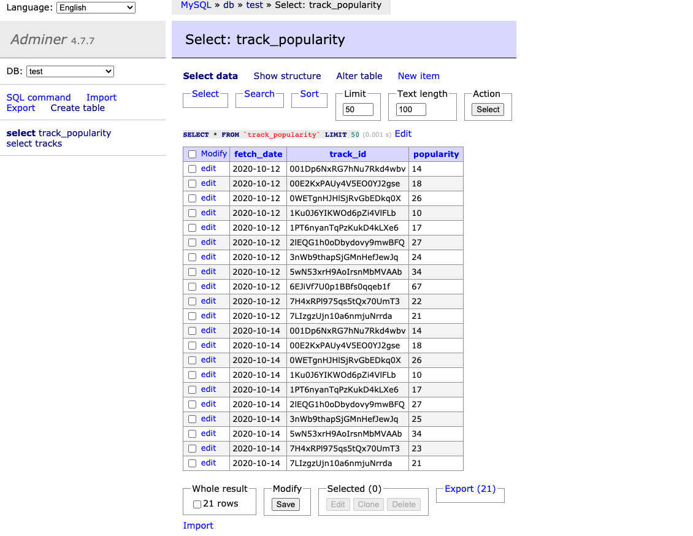

# Tracks popularity using Spotify for Developers API

## Installation

Make sure docker, docker-compose are installed

## To run

Fill in your Spotify Client ID and Client Secret in app/id_secret.json file and run:

```
docker-compose up --build
```

It starts 3 containers, the script itself, a mysql database and a simple database admin tool to be able to inspect the database in a browser.

The script fetches data about the tracks like name and popularity and exits. The database and admin tool keeps running. To quit, press ctrl-c.

The next day when you run `docker-compose up --build` it will fetch the latest popularity and add it to the database, so that you can track popularity over time.

## To view mysql tables

http://localhost:8080/  in the browser

```
Specify the following to login
System: Mysql
Server: db
Username: user
Password: 123
Database: test
```

Click "Select data" to view tracks and track_popularity tables in test db

Example data screenshots





## To run the tests

Make sure tox is installed

```
tox -p auto
```

If format is wrong, run
```
tox -e format
```


## Extend the data model to support playlist and tracks relation.

![ER Diagram]ERD.png

Extend the data model to include another table called playlist_tracks. It has three columns, fetch_date, playlist_uri and track_uri.
It assumes that the tracks in a playlist change only once per day.
And the application should store playlist_uri and track_uri daily into database using Spotify playlist web-api to support the two requirements asked in the 2nd task. 
